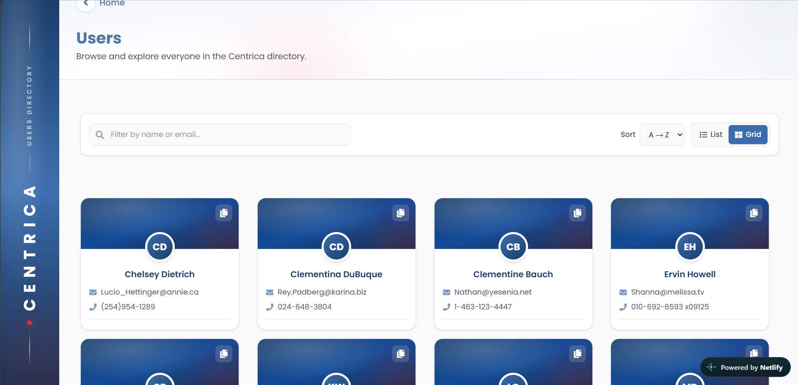

# Centrica User Directory

A take-home web app for browsing and exploring user information across an organisation.

**Live demo:** [centri-user.netlify.app](https://centri-user.netlify.app/)



---

## Features

- Landing page with navigation into the directory
- User list with grid and list views
- User detail pages
- Loading and error states for remote data

## Tech stack

- **React 19** + **TypeScript**
- **Vite**
- **React Router** for routing
- **TanStack React Query** for remote data
- **Tailwind CSS** for styling
- `useState` for local UI state (view mode, etc.)

## Getting started

**Requirements:** Node.js 18+ and npm

```bash
# 1. Clone the repository
git clone <repository-url>
cd lab

# 2. Install dependencies
npm install

# 3. Start the development server
npm run dev
```

Open the URL shown in the terminal (usually `http://localhost:5173`).

### Other scripts

| Command         | Description              |
| --------------- | ------------------------ |
| `npm run dev`   | Start the Vite dev server |
| `npm run build` | Type-check and production build |
| `npm run preview` | Preview the production build |
| `npm run lint`  | Run ESLint               |

## State management

This app is small, so local UI state uses React `useState`. Server/remote data is handled with TanStack React Query (caching, loading, and error handling).

## Future improvements

Given more time, I would add:

1. Full CRUD for managing users
2. Automated tests (unit and integration)
3. Pagination or infinite scroll for larger datasets

## Author

**Ramadhan Nyiringondo** — [Portfolio](https://ramproto.netlify.app/)
